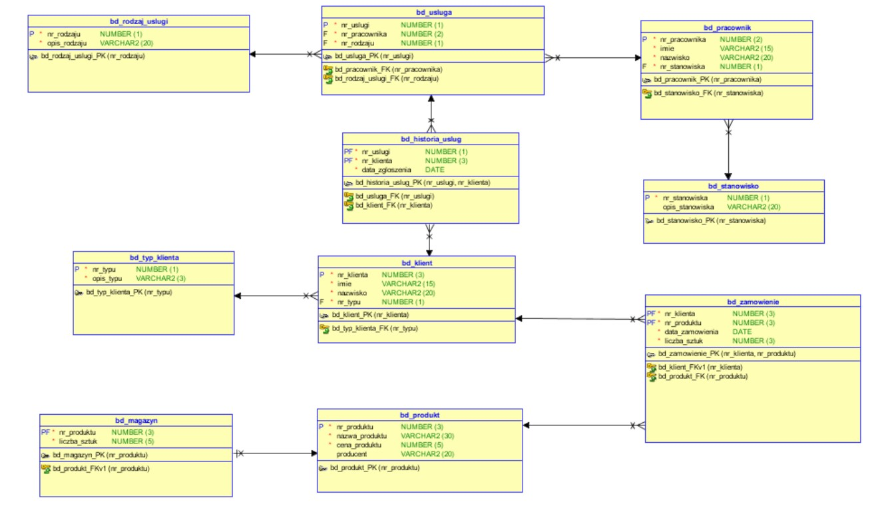
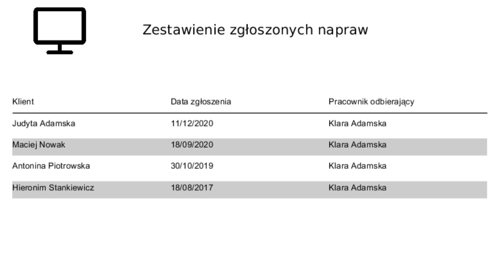
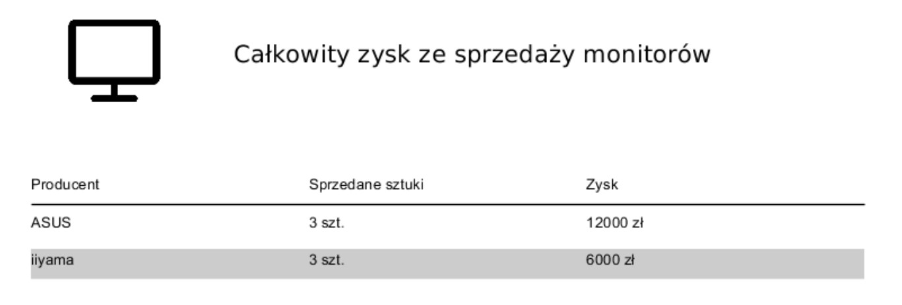

Electronic store elational database model done in Oracle environment with database implementation scripts.

# Contents
* [Project overview](#project-overview)
* [Database relational model](#database-relational-model)
* [Example reports](#example-reports)

# Project overview

Project is an implementation of a database for a store with
computer components. Transaction model in this database is order. 
Sites of the transaction are the customer and the shop. Database contains 
10 tables, which schema is placed bellow.

# Database relational model

# Example reports

